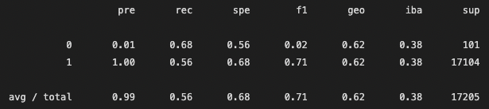
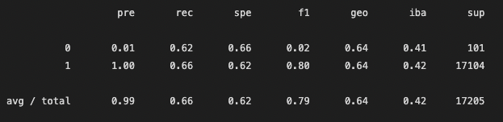
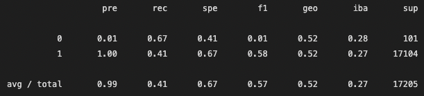
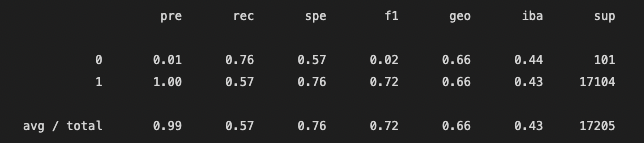
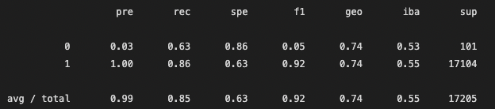
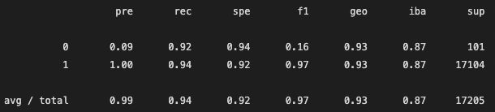

# Credit Risk Analysis

## Overview

The purpose of this analysis was to use a diverse set of machine learning models to evaluate credit risk from a peer-to-peer lending company.

## Results

The following bullet point will summarize the precision, accuracy and sensitive of the six models.

- Oversampling algorithm using RandomOverSampler:
  - 
  - The precision for fraudulent transactions is quite bad at just 1%, meaning that out of every chosen fraudulent transactions, only one would be correctly classified. Non-fraudulent transactions have a 100% precision while recall is .71, being much higher than the f1 score of .02 of its counterpart. The worst part about this model is the amount of false positives that there are. The number of false positives is not far off from the number of true negatives. The accuracy was 61.98%.
- This is the SMOTE Oversampling:
  - 
  - Precision for fraudulent transactions is also quite bad and the performance is similar for the past one. The accuracy was a bit higher at 64.32%, which by itself is meaningless given the imbalance of the data. Recall is a bit lower, compensating for a higher precision. The same problem of false positives also arises here. As in the past one, the ratio of true positives to false negative is roughly 2:1.
- Undersampling Using Cluster Centroid:
  - 
  - Precision sits the around all the past ones at 66.55%. The number of false negatives is starting to go down. Precision for fraudulent transactions is still super inaccurate. It is safe to say that these models have not been working optimally.
- Combination using SMOTEEN
  - 
  - Accuracy score went down by a lot, being 54%. However, the model is still giving similar results to the past ones. This model is still not good at predicting fraudulent transactions since it is giving a lot of false positives and false negatives.
- Balanced Random Forest Classifier
  - 
  - This model's accuracy improved by a lot. The accuracy was 85.48%. While the precision and accuracy for fraudulent transactions is still not good, the number of false positives was greatly reduced. Recall is higher than the previous models and accuracy precision went up from 1% to 3%.
- Easy Ensemble Classifier
  - 
  - Accuracy is at its highest point at 94.26%. The recall for fraudulent transaction is the highest one at 94%, while the precision is 9%. This is an acceptable tradeoff given the fact that it is more important to filter out all the fraudulent transaction than to be precise on those picked. F1 score is also the highest at around 97%.

## Summary

The results from the previous models were quite underwhelming since they did not prove to be very useful at detecting fraudulent transactions. While the results were getting better as the models progressed and evolved into others, I would not recommend anyone of this unless the team of people checking this transactions is large enough. The least bad model was the one using the Easy Ensemble Classifier. Even though it has a recall of 92%, its 9% accuracy is quite a deal-breaker if the workforce is not large enough. This means that out of 100 suspected fraudulent transactions that the team identifies, only 9 will actually be fraudulent. This will result in a lot of time wasted. On the other hand, a financial institution cannot accept any number of these transactions, meaning that sifting through many of them could very well be a normal business cost.
